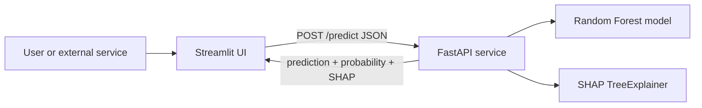

# ClinicalAI Risk Platform

Binary classification system with class-imbalance handling, SHAP explainability,
hyperparameter optimisation, experiment tracking, and a production REST API —
built on the Pima Indians Diabetes Dataset.

> **On framing:** The domain here is healthcare (my background is Biomedical
> Engineering), but every technique in this project — imbalanced learning,
> explainability, experiment tracking, model serving, and drift monitoring — is
> completely domain-agnostic. The same engineering decisions apply to fraud
> detection, churn prediction, or any binary classification problem.

## Highlights

- **Rigorous evaluation** — stratified 5-fold cross-validation with precision,
  recall, F1, confusion matrix, and ROC-AUC, instead of a single accuracy number.
- **Class-imbalance handling** — SMOTE vs `class_weight='balanced'`, compared
  fairly *inside* cross-validation to avoid data leakage.
- **Hyperparameter tuning** — Optuna (Bayesian optimisation) over Random Forest
  and XGBoost.
- **Experiment tracking** — every tuning trial logged to MLflow (80+ runs).
- **Explainability** — SHAP global summary and per-patient contribution breakdowns.
- **Production API** — FastAPI `/predict` returning prediction, probability, and
  SHAP contributions as JSON; the Streamlit app is a thin client that calls it.
- **Drift monitoring** — Evidently report comparing training vs incoming data.

## Results

| Model | CV ROC-AUC |
| --- | --- |
| Logistic Regression | 0.837 |
| Random Forest (tuned) | 0.842 |
| XGBoost (tuned) | 0.841 |

All three models land within the fold-to-fold noise (±0.02), so they are
**statistically tied**. Random Forest is served in production not because it is
"the best" but because it enables exact SHAP explanations via `TreeExplainer` at
no meaningful accuracy cost — a deliberate engineering trade-off.

On class imbalance: the baseline model catches only ~59% of diabetic patients
(recall 0.59). SMOTE raises that to ~0.67 at some cost to precision — a concrete
illustration of the recall/precision trade-off that matters in screening tools.

## Architecture



The model is a **service**, not a script buried in a UI. The frontend holds no ML
code — it only collects inputs and renders whatever the API returns. The same
endpoint could serve a mobile app or a hospital system unchanged.

## Tech stack

Python, scikit-learn, XGBoost, imbalanced-learn, Optuna, MLflow, SHAP, FastAPI,
Uvicorn, Streamlit, Evidently.

## Project structure

```
diabetes-predictor/
├── train.py                 # data cleaning, stratified CV, full evaluation
├── imbalance_experiment.py  # baseline vs class_weight vs SMOTE
├── tune.py                  # Optuna tuning, every trial logged to MLflow
├── shap_explain.py          # SHAP global + per-patient explanations
├── save_model.py            # trains the production model on all data
├── api.py                   # FastAPI /predict endpoint (prediction + SHAP)
├── app.py                   # Streamlit frontend that calls the API
├── drift_report.py          # Evidently data-drift report
├── requirements.txt
└── data/diabetes.csv
```

## Setup

```bash
python -m venv venv
venv\Scripts\activate          # Windows  (source venv/bin/activate on macOS/Linux)
pip install -r requirements.txt
```

## Usage

```bash
# 1. Evaluate with cross-validation
python train.py

# 2. Compare class-imbalance strategies
python imbalance_experiment.py

# 3. Tune hyperparameters and log to MLflow
python tune.py
mlflow ui                      # then open http://localhost:5000

# 4. Explain predictions with SHAP
python shap_explain.py         # writes shap_summary.png, shap_patient0.png

# 5. Train the production model
python save_model.py           # writes model.pkl, features.pkl

# 6. Serve the API  (terminal 1)
uvicorn api:app --reload       # docs at http://127.0.0.1:8000/docs

# 7. Run the frontend  (terminal 2)
streamlit run app.py

# 8. Generate a drift report
python drift_report.py         # writes drift_report.html
```

## Explainability

`shap_explain.py` produces a global summary (which features matter most across
all patients — Glucose, BMI, and Age lead, matching clinical knowledge) and a
per-patient waterfall showing exactly why one person was scored the way they
were (e.g. "Glucose +0.28 raises risk, BMI −0.08 lowers it"). The API returns
these contributions on every prediction, so no result is a black box.

## Experiment tracking

`tune.py` logs every Optuna trial to MLflow — parameters, the cross-validated
AUC, and a model tag — into a browsable dashboard (`mlflow ui`), giving a
reproducible record of the whole search rather than numbers that scroll away.

## Drift monitoring

`drift_report.py` compares a reference batch (training distribution) against a
simulated incoming batch and generates an Evidently HTML report flagging which
features have drifted. In production this would run on each incoming batch and
trigger retraining when drift crosses a threshold.

## Limitations

- The Pima dataset is **exclusively adult women** (Pima heritage, age 21+). The
  model is not valid for men or other populations without retraining — any such
  input is out-of-distribution.
- With only 768 samples, results carry real variance, which is why every score is
  reported as a cross-validated mean ± standard deviation.
- Biologically impossible zeros (Glucose, Blood Pressure, Skin Thickness, Insulin,
  BMI) are treated as missing and imputed with the column median.

## Author

Sree Harisankar — B.Tech Biomedical Engineering, IIT Hyderabad.
